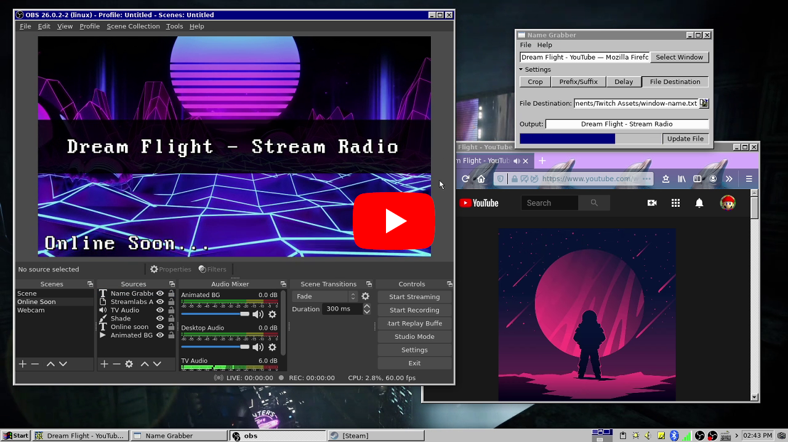

# Name Grabber
This program simply creates/updates `window-name.txt` in the specified directory at the interval of time that you set. This was intended to be used with OBS to update labels that show what music is playing in the web browser when all other methods fail.

# Obtaining
You can clone the repository by running `git clone https://gitlab.com/nickgirga/name-grabber.git` in a terminal. If you would prefer to just download the needed files, just grab `name-grabber` and `main.glade`.

# Dependencies
 - [python by the Python Software Foundation](https://www.python.org/)
 - [xdotool by Jordan Sissel](https://github.com/jordansissel/xdotool)
 - [zenity by GNOME](https://gitlab.gnome.org/GNOME/zenity)

# Installation
It should already be, but make sure the `name-grabber` file has the ability to be executed. There should be a checkbox for that in the file properties depending on your desktop environment and the file manager you use. If there is not one, you can make it executable by opening a terminal in the directory containing `name-grabber` and running `chmod +x name-grabber`. After that is done, you should be able to launch it by running `./name-grabber`. You must make sure `name-grabber` is being run with `main.glade` in the same folder.

# Usage
First, you must select a window. Name Grabber won't let you do anything until that is done. Click `Select Window` and then click the window you wish to grab the name from. After selecting a window, you can click the `Settings` expansion panel to change options like how many characters to clip off the start or end, if any text should be added before or after, how long the delay before updating the `window-name.txt` file should be, and where the `window-name.txt` file should be saved. After settings your optimal settings for your music source, you can click `File` > `Save Preset` to save all of these settings for easier future use. Then simply click `Update File` to start constantly updating the `window-name.txt` file.

Next time you start Name Grabber, you can simply select a window, click `File` > `Open Preset`, choose a preset, click `Update File`, and you're already running.

Once you have clicked `Update File` and you see the progress bar filling and resettings (representing the delay between updating your file), you can start reading the `window-name.txt` file using a program like OBS. To do this, click the plus icon on the `Sources` pane in the bottom left corner of OBS. Then, select `Text (FreeType 2)`. Tick the `Create new` radio button and give it a recognizable name, like `window-name.txt`. Make sure the `Make source visible` checkbox is checked and click `OK`. Once in the `Properties for 'Text (FreeType 2)'` window, scroll just below the main text field and check the `Read from file` checkbox. Then scroll down just a bit further and select the `Browse` button for the `Text File (UTF-8 or UTF-16)` field. Navigate to where you set your `File Destination` and select `window-name.txt` (or whatever you may have renamed it) and open it. Change any other settings you want and click `OK`. You now have a music label on OBS that will stay up-to-date so long as you keep the `window-name.txt` file up to date. Verify that the file is being kept up to date by checking if the `Update File` button is depressed and if the progress bar is continually filling itself.

Demonstration of presets feature:

