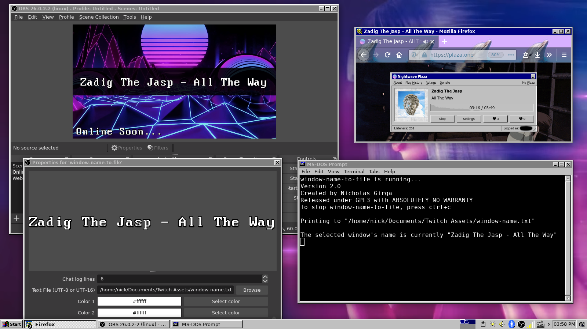

# window-name-to-file
This program simply creates/updates `window-name.txt` in the specified directory at the interval of time that you set. This was intended to be used with OBS to update labels that show what music is playing in the web browser when all other methods fail.

# Obtaining
You can clone the repository by running `git clone https://gitlab.com/nickgirga/name-grabber.git` in a terminal. If you prefer to only grab needed files, download `name-grabber` and `main.glade`

# Dependencies
 - [python by the Python Software Foundation](https://www.python.org/)
 - [xdotool by Jordan Sissel](https://github.com/jordansissel/xdotool)
 - [zenity by GNOME](https://gitlab.gnome.org/GNOME/zenity)

# Installation
It should already be, but make sure `name-grabber` has the ability to be executed. There should be a checkbox for that in the file properties depending on your desktop environment and the file manager you use. If there is not one, you can make it executable by opening a terminal in the directory containing our script and running `chmod +x name-grabber`. After that is done, you should be able to launch it by running `./name-grabber`.

# Usage
Before doing anything, you must select a window. Name Grabber won't let you do anything until a window is selected. Click `Select Window` and click the window you wish to monitor. After selecting a window, you can use the `Settings` expansion panel to change settings like how many characters to clip off the start or end, if any text should be added before or after, how long the delay for updating the file should be, and what file to save the window name to. After choosing the optimal settings for you music source, you can click `File` > `Save Preset` to save the settings as a preset for future use. Then click `Update File` to begin updating the file constantly.

Now if you launch Name Grabber, you will only need to select a window, click `File` > `Open Preset`, select your preset, and click `Update File` and you're already up and running.

If you would like OBS to start monitoring this file for an up-to-date music label on your stream, click the plus icon in the bottom left corner of OBS. Then select `Text (FreeType 2)`. Make sure the `Create new` radio button is ticked and give it a recognizable name, like `Name Grabber`. Ensure the `Make source visible` checkbox is checked and click `OK`. Once in the `Properties for 'Text (FreeType 2)'` window, check the `Read from file` checkbox just below the main text field. Then scroll just a bit further down and click `Browse` in the `Text File (UTF-8 or UTF-16)` field. Navigate to where you set your `File Destination` and select `window-name.txt` (or whatever you may have renamed it). Change any other settings you want and click `OK`. Verify the file is being kept up-to-date by making sure that the `Update File` button is depressed and that the progress bar is continually filling and resetting itself. As long as the file is being updated using Name Grabber, you have an updated music label.

Demonstration of presets feature:

